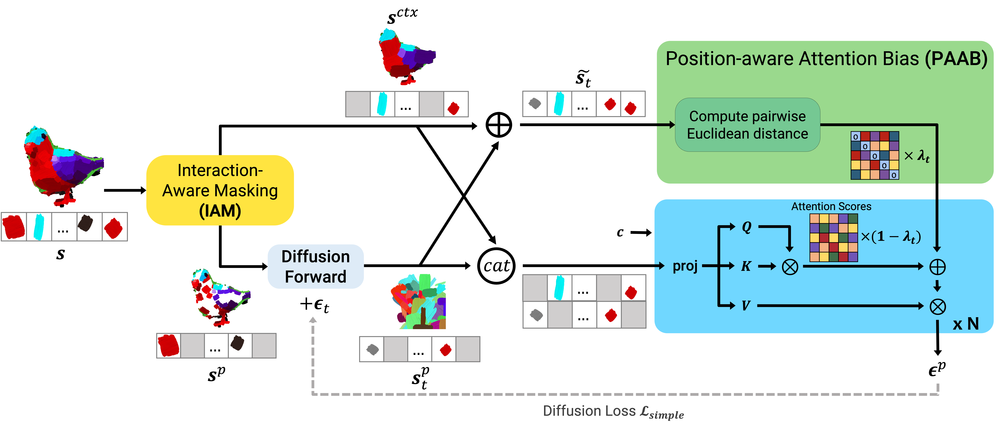

<div align="center">

[](https://arxiv.org/abs/2312.01800)
[](https://fodark.xyz/collaborative-neural-painting)

# Collaborative Neural Painting

[Nicola Dall'Asen](https://scholar.google.com/citations?user=e7lgiYYAAAAJ&hl), [Willi Menapace](https://scholar.google.com/citations?hl=en&user=31ha1LgAAAAJ), [Elia Peruzzo](https://scholar.google.com/citations?hl=en&user=nWEJGz0AAAAJ), [Enver Sangineto](https://scholar.google.com/citations?hl=en&user=eJZlvlAAAAAJ), [Yiming Wang](https://scholar.google.com/citations?hl=en&user=KBZ3zrEAAAAJ), [Elisa Ricci](https://scholar.google.com/citations?user=xf1T870AAAAJ&hl=en)

---


</div>

The process of painting fosters creativity and rational planning. However, existing generative AI mostly focuses on producing visually pleasant artworks, without emphasizing the painting process. We introduce a novel task, Collaborative Neural Painting (CNP), to facilitate collaborative art painting generation between humans and machines. Given any number of user-input brushstrokes as the context or just the desired object class, CNP should produce a sequence of strokes supporting the completion of a coherent painting. Importantly, the process can be gradual and iterative, so allowing users' modifications at any phase until the completion. Moreover, we propose to solve this task using a painting representation based on a sequence of parametrized strokes, which makes it easy both editing and composition operations. These parametrized strokes are processed by a Transformer-based architecture with a novel attention mechanism to model the relationship between the input strokes and the strokes to complete. We also propose a new masking scheme to reflect the interactive nature of CNP and adopt diffusion models as the basic learning process for its effectiveness and diversity in the generative field. Finally, to develop and validate methods on the novel task, we introduce a new dataset of painted objects and an evaluation protocol to benchmark CNP both quantitatively and qualitatively. We demonstrate the effectiveness of our approach and the potential of the CNP task as a promising avenue for future research.



## Setup

```bash
python -m venv .cnp
source .cnp/bin/activate
pip install -r requirements.txt
```

### Dataset

Coming soon.

### Checkpoint for evaluation

Download from [here](https://mega.nz/file/44IV1bKC#KYwP9JEKSyWNkiFZUZBKWHUsZaVNZwygxahVb8yim6c).

## Evaluation

- modify `ckpt_path` in `configs/eval.py` or pass it as parameter in the command line.

```bash
python src/eval.py experiment={bert,maskgit,mdt,continuous_t} ckpt_path=/path/to/checkpoint
```

## Training

```bash
python src/train.py experiment={bert,maskgit,mdt,continuous_t}
```

## Citation

```latex
@article{dallasen2023collaborative,
  title={Collaborative Neural Painting}, 
  author={Nicola Dall'Asen and Willi Menapace and Elia Peruzzo and Enver Sangineto and Yiming Wang and Elisa Ricci},
  year={2025},
  booktitle={Computer Vision and Image Understanding}
}
```
